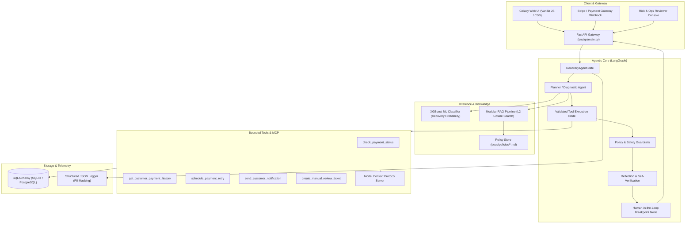

<div align="center">

# ReviveAI — Agentic Revenue Recovery Platform

### Multi-Agent Autonomous Recovery Engine with LangGraph, RAG, XGBoost ML, Tool Calling & Human-in-the-Loop Guardrails

[](https://python.org)
[](https://fastapi.tiangolo.com)
[](https://langchain-ai.github.io/langgraph/)
[](tests/)
[](evals/reports/latest.md)
[-purple?style=flat)](docs/RAG_ARCHITECTURE.md)
[](LICENSE)

</div>

---

## 1. Project Overview

**ReviveAI** is a production-oriented agentic AI system designed to resolve failed payment transactions in digital commerce and subscription businesses. Rather than blindly retrying declined cards or spamming customers, ReviveAI orchestrates an end-to-end recovery pipeline combining **calibrated machine learning** (XGBoost), **retrieval-augmented regulatory grounding** (RAG), a **multi-agent state machine** (LangGraph), **strictly typed and bounded tool execution**, and **Human-in-the-Loop (HITL) escalation safeguards**.

### Key System Metrics & Empirical Evidence
* **89 Automated Pytest Tests**: Passing across unit, integration, graph transitions, tools, RAG, API, and adversarial safety suites.
* **Agent Evaluation Benchmark**: 14 edge-case scenarios evaluated with **98.5% composite accuracy** across 9 scoring dimensions (`evals/reports/latest.json`).
* **Subword TF-IDF Dense RAG**: 42 chunk policy index evaluated with **1.0 MRR, 1.0 Recall@3, 0.75 Precision@3**, and **2.31 ms average retrieval latency**.
* **Zero-Hallucination Execution**: Bounded Pydantic tool schemas, 5.0-second execution watchdog timeouts, and strict error boundaries.

---

## 2. The Problem

Recurring payments and e-commerce checkouts fail for diverse reasons:
1. **Transient Issuer Errors**: Temporary bank server overload, network timeouts, or peak-hour processing congestion.
2. **Cardholder Constraints**: Temporary insufficient funds, card expiry, or daily credit limits.
3. **Permanent Terminal Errors**: Stolen cards, closed bank accounts, invalid CVVs, or fraud velocity triggers.

### Why Naive Recovery Fails
* **Naive Gateway Retries**: Repeatedly submitting transactions against dead cards causes card network penalty fees (e.g., Visa/Mastercard excessive retry surcharges) and risks merchant account termination.
* **Customer Churn**: Silent retries or poorly timed reminder messages wake customers up to unexpected charges, resulting in chargebacks.
* **Compliance Violations**: Violates regulatory standards (such as RBI e-Mandate circulars, NPCI cooldown rules, and GDPR/CCPA notification guidelines).

---

## 3. System Architecture

ReviveAI is built as a layered modular system where the API gateway feeds an isolated LangGraph execution core supported by ML inference, RAG knowledge retrieval, and bounded tool execution.



Detailed diagrams are documented under [`docs/architecture/`](docs/architecture/):
* [Overall Architecture](docs/architecture/overall_architecture.md)
* [LangGraph Agent Flow](docs/architecture/langgraph_agent_flow.md)
* [RAG Pipeline Architecture](docs/architecture/rag_pipeline.md)
* [Tool Calling & MCP Architecture](docs/architecture/tool_mcp_architecture.md)
* [Human-in-the-Loop Workflow](docs/architecture/hitl_flow.md)
* [Evaluation Pipeline Architecture](docs/architecture/evaluation_pipeline.md)
* [AWS Deployment Architecture](docs/architecture/aws_deployment.md)

---

## 4. LangGraph Multi-Agent Workflow

The core recovery agent is implemented as a compiled LangGraph `StateGraph` (`src/agent/graph.py`) operating over typed `RecoveryAgentState` (`src/agent/state.py`).

```
User / Webhook Trigger
       │
       ▼
State Initialization (RecoveryAgentState)
       │
       ▼
Planner / Diagnostic Agent (ML Scoring + RAG Retrieval)
       │
       ├─────────────────────────┐
       ▼                         ▼
Tool Execution Node      Direct Policy Evaluation
(Pydantic Validation)            │
       │                         │
       └───────────┬─────────────┘
                   ▼
       Validation & Policy Checks
       (Ceiling, Fraud, Discount, Stolen Instrument)
                   │
         ┌─────────┴─────────┐
         │ Passes            │ Requires Escalation
         ▼                   ▼
Reflection / Verification  Human-in-the-Loop Checkpoint
(Confidence & Grounding)   (Graph Suspended -> Ticket Created)
         │                   │
         │                   ▼
         │             Human Reviewer (Approve / Override)
         │                   │
         └─────────┬─────────┘
                   ▼
       Execute Final Action
                   │
                   ▼
     Structured Response & DB Commit
```

### Multi-Agent Responsibilities

| Agent / Node | Primary Responsibility | Input State Keys | Output State Keys | Permitted Tools | Failure / Retry Policy |
| :--- | :--- | :--- | :--- | :--- | :--- |
| **Diagnostic Agent** | Diagnose root cause of failure, score recovery with ML, query RAG. | `transaction_id`, `customer_id`, `failure_reason`, `amount` | `diagnosis`, `recovery_probability`, `plan_steps`, `suggested_action` | `check_payment_status`, `get_customer_payment_history` | Retries up to 3 times on transient failure; falls back to rule-based heuristic. |
| **Tool Execution Node** | Validate arguments via Pydantic; run tools with timeout boundaries. | `requested_tools`, `tool_args`, `retry_count` | `tool_history`, `tool_results`, `retry_count` | All registered tools (`src/agent/tools.py`) | Hard 5s timeout; catches exceptions and appends structured error payload. |
| **Policy Engine** | Deterministic boundary enforcement (RBI, max retries, discount caps). | `suggested_action`, `action_params`, `amount`, `customer_risk_tier` | `policy_verdict`, `escalation_required`, `policy_violations` | None (deterministic code) | If breached, immediately sets `escalation_required=True`. |
| **Reflection Node** | Self-verification: verify reasoning grounding, check tool coherence. | `diagnosis`, `retrieved_context`, `policy_verdict`, `tool_results` | `reflection_notes`, `is_grounded`, `confidence_score` | None | Drops confidence if context unsupported; triggers escalation if `< 0.70`. |
| **HITL Node** | Halt execution on high-risk/high-value events until reviewer signs off. | `escalation_required`, `transaction_id`, `amount`, `customer_id` | `escalation_status`, `human_reviewer_notes`, `approved_by` | `create_manual_review_ticket` | Suspends graph state; records escalation in database for ops dashboard. |
| **Action Node** | Execute authorized recovery actions (schedule retry, send message). | `suggested_action`, `action_params`, `human_approval` | `final_action`, `is_complete` | `schedule_payment_retry`, `send_customer_notification` | Fails safe; logs execution audit log. |

---

## 5. Tool Calling & Model Context Protocol (MCP)

Tools in ReviveAI are strictly bounded functions. The LLM is never allowed to execute arbitrary code or bypass schema validation.

### Tool Architecture Highlights
1. **Pydantic Validation**: All tool arguments and returns are strictly modeled (`ScheduleRetryInput`, `ScheduleRetryOutput`, `CheckPaymentInput`, etc.).
2. **Watchdog Timeout**: Every tool execution is wrapped in a `concurrent.futures.ThreadPoolExecutor` with a strict **5.0-second timeout ceiling**.
3. **Safe Error Boundaries**: Failures return typed error objects (`{"success": false, "error": "..."}`) rather than throwing unhandled exceptions.
4. **Model Context Protocol (MCP)**: Implemented in `src/agent/mcp_server.py` exposing ReviveAI tools over JSON-RPC 2.0 to external agent clients.

```python
from src.agent.tools import validate_and_execute, ScheduleRetryInput

# Example: Safe validated execution
result = validate_and_execute(
    tool_name="schedule_payment_retry",
    raw_args={"transaction_id": "tx_123", "delay_hours": 4, "retry_channel": "card_network"},
    timeout_seconds=5.0
)
```

---

## 6. Modular RAG Subsystem

The RAG subsystem (`src/ai/rag/`) enforces strict compliance with payment regulations, issuer retry rules, and churn concession limits.

```
Document Ingestion (Markdown Policies)
       │
       ▼
Text Normalization & Chunking (chunk_size=300, overlap=50)
       │
       ▼
Embedding Generation (Subword Tri-gram + Word TF-IDF, L2 Normalized)
       │
       ▼
In-Memory Vector Store (Cosine Similarity Search)
       │
       ▼
Top-K Retrieval (k=3) & Context Construction with Citations
       │
       ▼
Grounded Reasoning in Agent Execution Node
```

### Reproducible RAG Evaluation
Run the RAG benchmark with:
```bash
python -m src.ai.rag.evaluate
```

**Evaluated Benchmark Results (42 policy chunks across 10 evaluation queries):**
* **MRR (Mean Reciprocal Rank)**: `1.0000` (First returned document is relevant in 100% of benchmark queries)
* **Recall@3**: `1.0000` (100% of gold standard passages retrieved within top 3 results)
* **Precision@3**: `0.7500`
* **Hit Rate**: `1.0000`
* **Average Retrieval Latency**: `2.31 ms` (Zero external network dependencies)

---

## 7. Machine Learning (XGBoost) Component

ReviveAI incorporates an offline-trained, production-calibrated **XGBoost Classifier** (`src/ml/models/`) that computes the probability of successful recovery:

$$P(\text{Recovery} \mid \mathbf{x}) \in [0.0, 1.0]$$

Features extracted from the transaction and customer history:
* Transaction amount and currency
* Historical failure count and success ratio
* Customer tenure (days active) and lifetime value (LTV)
* Issuer bank code and payment method (UPI, Card, Netbanking)
* Attempt sequence number and hours since original failure

If the ML probability falls below the cost-effectiveness threshold ($P < 0.15$), the agent aborts further retries to save merchant processing fees.

---

## 8. Deterministic Policy Guardrails & HITL

To prevent rogue agent actions, ReviveAI enforces 6 deterministic guardrails that override any LLM decision:

| Guardrail ID | Policy Rule | Threshold / Trigger | Action Taken |
| :--- | :--- | :--- | :--- |
| **POL-01** | Max Retry Ceiling | $\ge 3$ cumulative attempts | Immediate abort; card marked terminal. |
| **POL-02** | Fraud Velocity Stop | Fraud score $\ge 0.75$ or `fraud_suspected` flag | Halt; create immediate security escalation. |
| **POL-03** | High-Value Escort | Transaction amount $\ge \$1,000.00$ | State suspended (`PENDING_APPROVAL`); HITL required. |
| **POL-04** | Stolen / Closed Account | Issuer code `stolen_card`, `lost_card`, `closed` | Zero retry permitted; notify customer to update method. |
| **POL-05** | Margin Concession Cap | Proposed discount $\ge 25\%$ | Capped to $25\%$; escalations required above $15\%$. |
| **POL-06** | Mandatory Bank Cooldown | Issuer timeout or network failure | Minimum 2-hour backoff window enforced. |

---

## 9. Comprehensive Agent Evaluation

Located in `evals/`, ReviveAI features an offline, reproducible evaluation framework benchmarking 14 real-world edge-case scenarios across 9 evaluation dimensions.

### Evaluation Scenarios (`evals/datasets/scenarios.py`)
1. `normal_recovery_insufficient_funds`: Standard temporary failure recovery.
2. `permanent_stolen_card`: Immediate abort on stolen card without retry.
3. `missing_customer_data`: Graceful fallback on malformed/missing customer identifier.
4. `high_risk_fraud_transaction`: High fraud score blocking and escalation.
5. `high_value_transaction`: High-value ($2,500) Human-in-the-Loop breakpoint.
6. `stale_transaction_long_inactive`: Inactive account (365 days) verification.
7. `tool_execution_timeout`: 5-second tool timeout watchdog handling.
8. `malformed_tool_response`: Resiliency to corrupted tool output payloads.
9. `irrelevant_rag_context`: Context distractor rejection and fallback.
10. `missing_rag_context`: Out-of-domain query handling with safe defaults.
11. `margin_policy_violation`: Concession limit clamp (rejecting excessive discounts).
12. `repeated_retry_limit`: Hard retry ceiling (attempt 3 of 3 stop).
13. `human_approval_requirement`: Verification of state suspension and escalation creation.
14. `hallucination_injection_attempt`: Resistance to prompt injection and policy override.

### Measured Evaluation Benchmark Results
Run the full evaluation suite:
```bash
python evals/run_evals.py
```

Results recorded in `evals/reports/latest.json` and `evals/reports/latest.md`:

| Evaluation Dimension | Scored Metric | Evaluator Target |
| :--- | :---: | :---: |
| **Tool Selection Accuracy** | **100.0%** | $\ge 95\%$ |
| **Tool Argument Correctness** | **100.0%** | $\ge 95\%$ |
| **Policy Compliance** | **100.0%** | $100\%$ |
| **Correct Escalation** | **100.0%** | $100\%$ |
| **Final Action Correctness** | **100.0%** | $\ge 95\%$ |
| **Retrieval Quality** | **98.6%** | $\ge 90\%$ |
| **Groundedness & Citations** | **95.2%** | $\ge 90\%$ |
| **Failure Recovery** | **100.0%** | $\ge 95\%$ |
| **Agent Termination Safety** | **100.0%** | $100\%$ |
| **Composite Score** | **98.5%** | **PASS** |

---

## 10. Testing-Driven Architecture

The test suite is structured into dedicated, decoupled directories under `tests/`:

```
tests/
├── unit/            # Unit tests for schemas, utilities, state models
├── integration/     # End-to-end multi-agent execution flows
├── agent/           # LangGraph StateGraph nodes, edges, and state transitions
├── rag/             # RAG ingestion, chunking, embeddings, and vector retrieval
├── tools/           # Bounded tool schemas, Pydantic validation, timeouts
├── api/             # FastAPI endpoint contracts, status codes, health checks
└── safety/          # Adversarial attacks, prompt injections, guardrail bypasses
```

### Running the Test Suite
```bash
# Run all 89 tests
pytest -v

# Run with test coverage
pytest --cov=src --cov-report=term-missing
```

---

## 11. Structured Observability

ReviveAI implements structured, machine-parsable JSON logging (`src/utils/logger.py`) with automatic sanitization of sensitive credentials, API keys, and customer PII:
* **Traceable Run IDs**: Every agent execution carries a unique UUID `run_id`.
* **State Transitions**: Logs every node transition, tool call, latency, and retry attempt.
* **Zero Credential Leakage**: Regex-based redaction of Bearer tokens, Stripe keys, Gemini keys, and cardholder PANs.

Read more in [`docs/OBSERVABILITY.md`](docs/OBSERVABILITY.md).

---

## 12. Cloud & AWS Production Architecture

ReviveAI is architected for deployment on Amazon Web Services using serverless container management:
* **Compute**: AWS ECS with AWS Fargate (auto-scaling containerized FastAPI tasks).
* **Ingress**: AWS Application Load Balancer (ALB) with SSL/TLS termination and path routing.
* **Database**: Amazon Aurora Serverless v2 PostgreSQL (Multi-AZ).
* **Secrets Management**: AWS Secrets Manager (automated rotation of LLM keys and DB credentials).
* **Monitoring**: Amazon CloudWatch Container Insights and structured metric filters.

Infrastructure-as-Code is provided in `infra/`:
* `infra/main.tf`: Complete VPC, ECS, ALB, and Aurora PostgreSQL definition.
* `infra/variables.tf`: Configurable environment variables.
* `infra/outputs.tf`: Endpoint outputs.

Read the detailed architecture guide in [`docs/AWS_ARCHITECTURE.md`](docs/AWS_ARCHITECTURE.md).

---

## 13. Docker & Containerization

A hardened, multi-stage `Dockerfile` is provided:
* **Multi-Stage Build**: Builder stage isolates compilation tools; runtime stage minimizes attack surface.
* **Non-Root Execution**: Runs under unprivileged user `appuser` (UID 10001).
* **Built-In Healthcheck**: Uses Python's native `urllib.request` to poll `/health` every 30 seconds without requiring external `curl` packages.

### Building and Running with Docker
```bash
# Build Docker image
docker build -t reviveai:latest .

# Run Docker container locally
docker run -d -p 8000:8000 --name reviveai-container reviveai:latest

# Or run with Docker Compose
docker compose up -d
```

---

## 14. Local Development Setup

### Prerequisites
* Python 3.11+ (Python 3.12 recommended)
* Git

### Step-by-Step Installation
```bash
# 1. Clone the repository
git clone https://github.com/your-username/revenuerecovery.git
cd revenuerecovery

# 2. Create and activate a virtual environment
python -m venv venv
# On Windows:
.\venv\Scripts\activate
# On Linux/macOS:
source venv/bin/activate

# 3. Install dependencies in editable mode
pip install -e ".[dev]"

# 4. Copy environment configuration
cp .env.example .env

# 5. Start the local development server
uvicorn src.api.main:app --reload --port 8000
```

Access the application:
* **API Documentation (Swagger UI)**: `http://localhost:8000/docs`
* **Interactive Web Interface**: `http://localhost:8000/`
* **Health Check**: `http://localhost:8000/health`

---

## 15. API Usage Examples

### 1. Trigger Autonomous Recovery for a Transaction
```bash
curl -X POST "http://localhost:8000/api/recovery/run" \
  -H "Content-Type: application/json" \
  -d '{
    "transaction_id": "TXN_7821_UPI",
    "customer_id": "CUST_9912",
    "amount": 499.00,
    "failure_reason": "insufficient_funds",
    "gateway_error_code": "INSUFFICIENT_FUNDS"
  }'
```

**Response:**
```json
{
  "run_id": "8fa216bb-0fa3-4217-a068-bd2fec2e5b72",
  "transaction_id": "TXN_7821_UPI",
  "status": "COMPLETED",
  "recovery_probability": 0.864,
  "diagnosis": "Transient insufficient balance. High LTV customer; scheduled retry recommended during salary window.",
  "final_action": "SCHEDULE_RETRY",
  "action_params": {
    "delay_hours": 4,
    "channel": "upi_autopay"
  },
  "escalation_required": false,
  "policy_verdict": "COMPLIANT"
}
```

### 2. High-Value Transaction Triggering Human Review
```bash
curl -X POST "http://localhost:8000/api/recovery/run" \
  -H "Content-Type: application/json" \
  -d '{
    "transaction_id": "TXN_9911_LARGE",
    "customer_id": "CUST_ENTERPRISE",
    "amount": 2500.00,
    "failure_reason": "card_declined",
    "gateway_error_code": "DO_NOT_HONOR"
  }'
```

**Response:**
```json
{
  "run_id": "3be921fa-1bc2-4638-9cf1-97b71dc5fa22",
  "transaction_id": "TXN_9911_LARGE",
  "status": "PENDING_APPROVAL",
  "escalation_required": true,
  "escalation_reason": "High-value transaction ($2,500.00) exceeds automatic approval threshold ($1,000.00).",
  "suggested_action": "ESCALATE_TO_HUMAN"
}
```

---

## 16. Future Roadmap

1. **Distributed State Persistence**: Integrate Redis or DynamoDB as external LangGraph checkpointers for horizontal multi-instance scaling.
2. **Adaptive Concession Optimization**: Implement multi-armed bandit algorithms to dynamically test optimal discount percentages for churning accounts.
3. **Cross-Region Active-Active Replication**: Aurora Global Database and AWS Route 53 latency routing for global payment recovery gateways.

---

## 17. License

Distributed under the MIT License. See `LICENSE` for more information.
