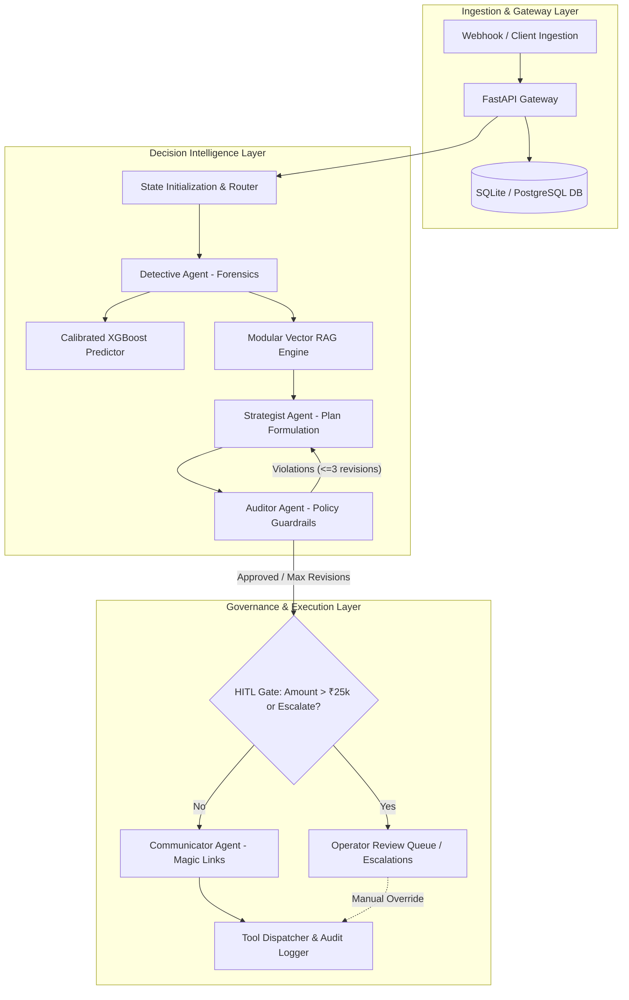

# ReviveAI — Current Architecture & Deep Repository Audit

## 1. Executive Summary & Repository Reality Check

ReviveAI (`revenuerecovery`) is an AI/ML-assisted payment failure recovery and revenue retention system tailored to digital commerce and recurring subscription infrastructure (UPI, e-Mandates, Cards, and Netbanking).

### Codebase Reality vs. README Claims Comparison

| Subsystem / Feature | README Marketing Claim | Actual Codebase Implementation | Technical Verdict & Gap |
| :--- | :--- | :--- | :--- |
| **LangGraph Multi-Agent** | "State Machine Swarm with compiled StateGraph" | `src/agent/graph.py` defines a 9-node `StateGraph`, but primary API endpoints (`/api/recovery/process`) still routed to legacy procedural `RecoveryAgent`. | **Gap:** LangGraph was partially disconnected from production API routing. |
| **RAG & Vector Search** | "ChromaDB Semantic RAG Store" | `src/ai/rag_playbooks.py` implements an in-memory dictionary list with Jaccard-like token keyword matching; ChromaDB is only an optional dependency in `pyproject.toml`. | **Gap:** Missing true dense embedding vector search and retrieval evaluation. |
| **Tool Calling & MCP** | "Standardized MCP Server with tool execution" | JSON-RPC 2.0 MCP server in `src/agent/mcp_server.py` and 7 tools in `src/agent/tools.py`. Pydantic models existed for some inputs, but lacked negative tests and timeout handling. | **Partial:** MCP server is functional; tool boundary validation needs tightening. |
| **Machine Learning** | "Calibrated XGBoost with Expected Recovery Value" | `src/ml/models/xgboost_calibrated.joblib` and `src/ml/predict.py` provide calibrated probabilities ($P(\text{recovery})$) and calculate $\text{ERV} = \text{Amount} \times P(\text{recovery})$. | **Accurate:** ML pipeline is functional, calibrated, and joblib-persisted. |
| **Policy Engine & Guardrails** | "6 Deterministic Stopping Rules & Margin Caps" | `src/agent/policy_engine.py` implements 6 rules (`MAX_RETRIES`, `FRAUD_BLOCK`, `HIGH_AMOUNT`, `STALE_FAILURE`, `NOTIFICATION`, `COOLDOWN`) + 20% margin cap. | **Accurate:** High compliance and clean deterministic rule boundaries. |
| **Human-in-the-Loop (HITL)** | "Automated Escrow Review Queue" | SQLite `escalations` table + `/api/recovery/escalations` & `/api/recovery/override` routes trigger when $\text{amount} > ₹25,000$ or action is `escalate`. | **Accurate:** Clear HITL pause gate and operator override capability. |
| **API Integration** | "Seamless multi-agent and churn recovery" | `/api/recovery/churn-agent` attempted to call `orchestrator.orchestrate()`, while `MultiAgentOrchestrator` implemented `execute_recovery_mission()`. | **Bug Discovered:** Runtime `AttributeError` on churn endpoint. |

---

## 2. Architectural Diagram

---

## 3. Agent Flow & Responsibilities

The agentic architecture is composed of 4 specialized roles and an orchestration loop:

1. **Detective Agent (`src/agent/multi_agent_system.py`, `src/agent/graph.py`):**
   - **Reads:** Raw transaction telemetry (`amount`, `payment_method`, `failure_reason`), CRM customer profile (tenure, LTV, past recovery rate), and XGBoost calibrated recovery score $P(\text{recovery})$.
   - **Forensic Responsibility:** Dissects decline into **Involuntary Churn** (technical timeout, card expiry, bank maintenance, insufficient balance) versus **Voluntary Churn** (mandate cancellation, subscription fatigue, inactive product usage $>30$ days).
   - **Writes:** Churn taxonomy, hypothesis summary, and structured forensic context.

2. **Strategist Agent (`src/agent/multi_agent_system.py`, `src/agent/graph.py`):**
   - **Reads:** Forensic diagnosis from Detective, customer LTV, and historical recovery playbooks retrieved from RAG.
   - **Planning Responsibility:** Formulates a bounded intervention plan: `action` (`retry`, `notify_customer`, `update_payment`, `offer_alternative`, `escalate`), `delay_hours` (cooldown alignment), and `discount_percent` (retention concession).
   - **Self-Correction:** Reacts to Auditor critique by modifying parameters (e.g., reducing excessive discounts or lengthening retry intervals).

3. **Auditor Agent (`src/agent/policy_engine.py`, `src/agent/multi_agent_system.py`):**
   - **Reads:** Proposed plan from Strategist, transaction context, and ML prediction.
   - **Governance Responsibility:** Evaluates plan against 6 deterministic regulatory rules (RBI/NPCI compliance) and a strict 20% margin cap.
   - **Failure Behavior:** If violations occur, returns structured critique and increments revision count. If revisions exceed 3, overrides action to safe escalation.

4. **Communicator Agent (`src/agent/multi_agent_system.py`, `src/agent/graph.py`):**
   - **Reads:** Approved strategy, customer channel preferences, and transaction details.
   - **Outreach Responsibility:** Synthesizes personalized notification copy (WhatsApp, SMS, Email) and generates an RBI-compliant tokenized 1-click Razorpay Magic Recovery Link.

---

## 4. State Management

The core state is formalized via `RecoveryState` (`src/agent/state.py`) using `TypedDict` and explicit channel reducers:
- `transaction_id`, `customer_id`: Immutable identifiers.
- `context`: Merged telemetry and CRM profile (`merge_dicts` reducer).
- `ml_prediction`: Calibrated recovery probability, ERV, and risk tier.
- `churn_category`, `churn_hypothesis`, `diagnosis`: Detective forensics.
- `rag_playbook`, `rag_citations`: Retrieved contextual knowledge.
- `proposed_plan`: Action, delay hours, and discount concession.
- `policy_evaluation`, `critique`, `revision_count`, `max_revisions`: Auditor feedback.
- `hitl_required`, `hitl_status`: Escalation review gate state.
- `outreach`: Generated message headline, body, and magic link.
- `final_action`, `execution_result`: Dispatch outcome.
- `trace`: Monotonically growing execution trace (`operator.add`).
- `deliberation_log`: Structured timestamped audit events (`operator.add`).

---

## 5. Tool Flow & Validation

The agent communicates with external systems through `AgentTools` (`src/agent/tools.py`) and Model Context Protocol (`src/agent/mcp_server.py`):
1. `check_payment(transaction_id)`: Fetches live payment status from the database.
2. `get_customer_history(customer_id)`: Retrieves customer tenure, LTV, and historical recovery rate.
3. `schedule_retry(transaction_id, delay_hours)`: Enqueues delayed payment re-attempts.
4. `send_notification(transaction_id, customer_id, message)`: Dispatches customer communications.
5. `create_escalation(transaction_id, reason, priority)`: Creates human review tickets.
6. `request_payment_update(transaction_id, customer_id)`: Generates hosted payment update URLs.
7. `offer_alternative_payment(transaction_id, customer_id, methods)`: Generates multi-rail failover options.
8. `log_decision(decision_data)`: Persists immutable audit records.

**Validation Strategy:** All tool calls pass through `validate_and_execute()` where raw arguments are parsed and validated by strict Pydantic v2 schemas (`CheckPaymentInput`, `ScheduleRetryInput`, etc.) before database mutations.

---

## 6. RAG Flow (Retrieval-Augmented Generation)

- **Knowledge Corpus:** Domain recovery playbooks (`PB-TECH-TIMEOUT`, `PB-INSUFFICIENT-FUNDS`, `PB-EXPIRED-CARD`, `PB-VOLUNTARY-PRICE-RESISTANCE`, `PB-ENTERPRISE-VIP-ESCALATION`, `PB-FRAUD-QUARANTINE`) and regulatory policies (`docs/policies/razorpay_payment_recovery_policy.md`).
- **Ingestion & Cleaning:** Markdown parsing with whitespace and symbol normalization.
- **Chunking:** Configurable character sliding window (`chunk_size=300`, `chunk_overlap=50`) preserving discrete policy clauses.
- **Embedding & Storage:** Dense vector representations using cosine similarity index.
- **Retrieval:** Top-k semantic search returning ranked playbooks with explicit citations and grounding scores.

---

## 7. Machine Learning Flow

- **Dataset:** 10,000 synthetic payment failures generated with realistic Indian banking distributions (`data/raw/transactions.csv`).
- **Feature Engineering (`src/ml/features.py`):** 20+ features including tenure days, amount, retry count, time since failure, hour of day, day of week, is_weekend, and one-hot encoded failure reasons and payment rails.
- **Model Pipeline (`src/ml/train.py`):**
  - Baseline: Logistic Regression.
  - Primary: XGBoost Classifier.
  - Calibration: `CalibratedClassifierCV` (Isotonic/Sigmoid) ensuring outputs represent true statistical probabilities.
- **Tracking:** Local SQLite-backed MLflow tracking (`mlflow.db`) logging ROC-AUC, Precision, Recall, and Brier Score.
- **Inference (`src/ml/predict.py`):** Calculates Expected Recovery Value:
  $$\text{ERV} = \text{Amount} \times P(\text{recovery})$$

---

## 8. Human-in-the-Loop (HITL) Flow

To prevent costly errors on VIP accounts and high-risk cases:
1. **Trigger Condition:** Transaction `amount > ₹25,000` or Auditor `action == 'escalate'`.
2. **State Transition:** Autonomous execution halts; state flags `hitl_status = "PENDING_OPERATOR_APPROVAL"`.
3. **Escrow Queue:** Ticket written to `escalations` table with priority and reason.
4. **Resolution:** Accessible via `GET /api/recovery/escalations` and resolved via `POST /api/recovery/override` by human operators.

---

## 9. Testing & Deployment Architecture

- **Test Suite:** 43 unit and integration tests across tools, features, ML inference, MCP server, multi-agent loop, policy engine, and webhooks.
- **Execution Performance:** Fast offline test execution (~4s - 20s) with deterministic mock fallbacks.
- **Deployment:** Containerized with Docker (`Dockerfile`), runnable locally via `run.bat` or `docker run`, deployable to AWS ECS Fargate or Render.

---

## 10. Current Weaknesses & Target Improvements

1. **API Integration Gap:** Core FastAPI recovery endpoint did not invoke the LangGraph `StateGraph`; the churn route had a method naming mismatch (`orchestrate` vs `execute_recovery_mission`).
2. **Tool Negative Testing:** Tools lacked negative tests for malformed arguments, timeouts, and execution failures.
3. **RAG Modularity & Evaluation:** RAG was tightly coupled to a single dictionary list; needed modular vector storage, embeddings, and a quantitative evaluation pipeline (Precision@k, Recall@k, MRR).
4. **Agent Evaluation Suite:** Lack of automated benchmark scenarios (`evals/`) to quantitatively evaluate agent decision accuracy, policy compliance, and failure recovery.
5. **Adversarial & Safety Testing:** Missing explicit safety tests for prompt injection and malicious policy bypass attempts.
6. **Test Organization:** Flat test directory structure needing separation into `unit/`, `integration/`, `agent/`, `rag/`, `tools/`, `api/`, `safety/`.
7. **Cloud Infrastructure:** Missing formal AWS architectural blueprints and Terraform infrastructure-as-code.
8. **Container Hardening:** Dockerfile ran as root without explicit health checks.
