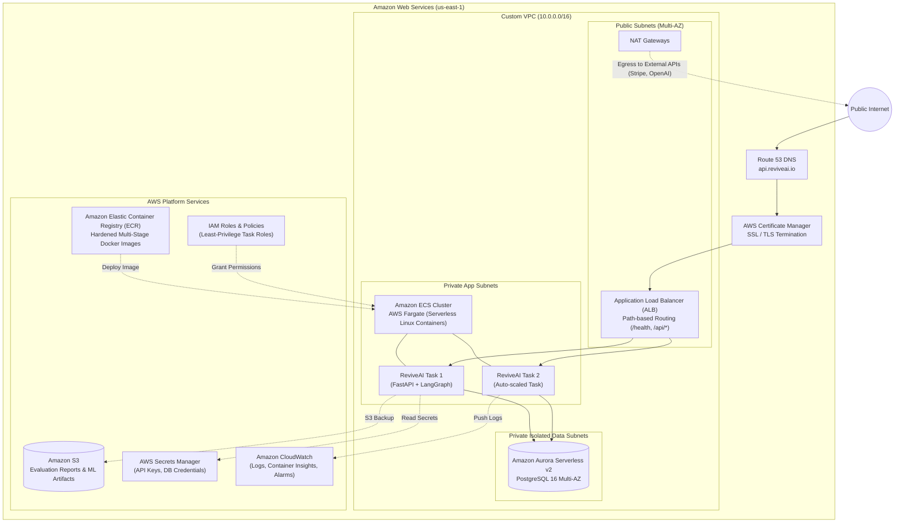

# ReviveAI — AWS Cloud Deployment Architecture

This document illustrates the target production deployment on Amazon Web Services (AWS) using serverless container management, managed PostgreSQL, and automated secret injection.

