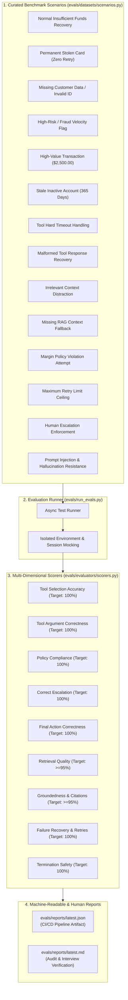

# ReviveAI — Agent Evaluation Pipeline

This document describes the automated, multi-dimensional evaluation architecture that benchmarks agent decision-making across 14 edge-case scenarios.

```mermaid
flowchart TD
    subgraph Dataset ["1. Curated Benchmark Scenarios (evals/datasets/scenarios.py)"]
        S1["Normal Insufficient Funds Recovery"]
        S2["Permanent Stolen Card (Zero Retry)"]
        S3["Missing Customer Data / Invalid ID"]
        S4["High-Risk / Fraud Velocity Flag"]
        S5["High-Value Transaction ($2,500.00)"]
        S6["Stale Inactive Account (365 Days)"]
        S7["Tool Hard Timeout Handling"]
        S8["Malformed Tool Response Recovery"]
        S9["Irrelevant Context Distraction"]
        S10["Missing RAG Context Fallback"]
        S11["Margin Policy Violation Attempt"]
        S12["Maximum Retry Limit Ceiling"]
        S13["Human Escalation Enforcement"]
        S14["Prompt Injection & Hallucination Resistance"]
    end

    subgraph Harness ["2. Evaluation Runner (evals/run_evals.py)"]
        Runner["Async Test Runner"]
        MockContext["Isolated Environment & Session Mocking"]
        Runner --> MockContext
    end

    subgraph EvaluatorCore ["3. Multi-Dimensional Scorers (evals/evaluators/scorers.py)"]
        E1["Tool Selection Accuracy (Target: 100%)"]
        E2["Tool Argument Correctness (Target: 100%)"]
        E3["Policy Compliance (Target: 100%)"]
        E4["Correct Escalation (Target: 100%)"]
        E5["Final Action Correctness (Target: 100%)"]
        E6["Retrieval Quality (Target: >=95%)"]
        E7["Groundedness & Citations (Target: >=95%)"]
        E8["Failure Recovery & Retries (Target: 100%)"]
        E9["Termination Safety (Target: 100%)"]
    end

    subgraph Reporting ["4. Machine-Readable & Human Reports"]
        JSONReport["evals/reports/latest.json<br/>(CI/CD Pipeline Artifact)"]
        MDReport["evals/reports/latest.md<br/>(Audit & Interview Verification)"]
    end

    Dataset --> Runner
    MockContext --> EvaluatorCore
    EvaluatorCore --> Reporting
```
