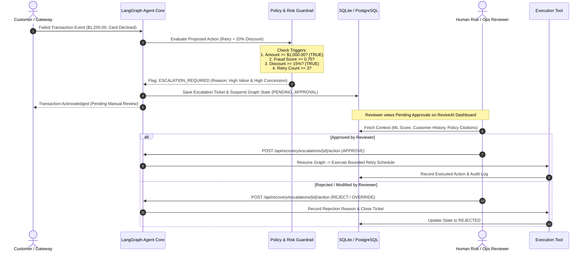

# ReviveAI — Human-in-the-Loop (HITL) Workflow

This document illustrates the escalation triggers, checkpoint suspension, and human supervisor intervention path within ReviveAI.

```mermaid
sequenceDiagram
    autonumber
    actor Customer as Customer / Gateway
    participant Orchestrator as LangGraph Agent Core
    participant Policy as Policy & Risk Guardrail
    participant DB as SQLite / PostgreSQL
    actor Reviewer as Human Risk / Ops Reviewer
    participant FinalAction as Execution Tool

    Customer->>Orchestrator: Failed Transaction Event ($1,250.00, Card Declined)
    Orchestrator->>Policy: Evaluate Proposed Action (Retry + 20% Discount)
    
    Note over Policy: Check Triggers:<br/>1. Amount >= $1,000.00? (TRUE)<br/>2. Fraud Score >= 0.75?<br/>3. Discount >= 15%? (TRUE)<br/>4. Retry Count >= 3?

    Policy-->>Orchestrator: Flag: ESCALATION_REQUIRED (Reason: High Value & High Concession)
    
    Orchestrator->>DB: Save Escalation Ticket & Suspend Graph State (PENDING_APPROVAL)
    Orchestrator-->>Customer: Transaction Acknowledged (Pending Manual Review)

    Note over Reviewer,DB: Reviewer views Pending Approvals on ReviveAI Dashboard
    Reviewer->>DB: Fetch Context (ML Score, Customer History, Policy Citations)
    
    alt Approved by Reviewer
        Reviewer->>Orchestrator: POST /api/recovery/escalations/{id}/action (APPROVE)
        Orchestrator->>FinalAction: Resume Graph -> Execute Bounded Retry Schedule
        FinalAction->>DB: Record Executed Action & Audit Log
    else Rejected / Modified by Reviewer
        Reviewer->>Orchestrator: POST /api/recovery/escalations/{id}/action (REJECT / OVERRIDE)
        Orchestrator->>FinalAction: Record Rejection Reason & Close Ticket
        FinalAction->>DB: Update State to REJECTED
    end
```
