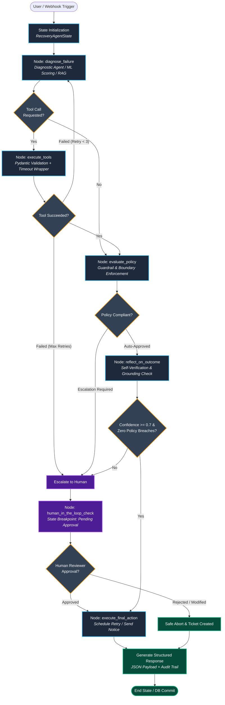

# ReviveAI — LangGraph Agent Workflow

This document illustrates the execution lifecycle of `RecoveryAgentState` across nodes and conditional edges in the compiled LangGraph `StateGraph`.

```mermaid
flowchart TD
    Start([User / Webhook Trigger]) --> Init[State Initialization<br/><i>RecoveryAgentState</i>]
    Init --> Diagnose[Node: diagnose_failure<br/><i>Diagnostic Agent / ML Scoring / RAG</i>]
    
    Diagnose --> ToolDecision{Tool Call<br/>Requested?}
    
    ToolDecision -- Yes --> ToolNode[Node: execute_tools<br/><i>Pydantic Validation + Timeout Wrapper</i>]
    ToolDecision -- No --> PolicyCheck[Node: evaluate_policy<br/><i>Guardrail & Boundary Enforcement</i>]
    
    ToolNode --> ToolResultCheck{Tool Succeeded?}
    ToolResultCheck -- Yes --> PolicyCheck
    ToolResultCheck -- Failed (Retry < 3) --> Diagnose
    ToolResultCheck -- Failed (Max Retries) --> EscalatePolicy[Escalate to Human]
    
    PolicyCheck --> PolicyDecision{Policy Compliant?}
    PolicyDecision -- Escalation Required --> EscalatePolicy
    PolicyDecision -- Auto-Approved --> Reflect[Node: reflect_on_outcome<br/><i>Self-Verification & Grounding Check</i>]
    
    EscalatePolicy --> HITL[Node: human_in_the_loop_check<br/><i>State Breakpoint: Pending Approval</i>]
    
    HITL --> HumanDecision{Human Reviewer<br/>Approval?}
    HumanDecision -- Approved --> FinalAction[Node: execute_final_action<br/><i>Schedule Retry / Send Notice</i>]
    HumanDecision -- Rejected / Modified --> TerminateSafe[Safe Abort & Ticket Created]
    
    Reflect --> ReflectionCheck{Confidence >= 0.7 &<br/>Zero Policy Breaches?}
    ReflectionCheck -- Yes --> FinalAction
    ReflectionCheck -- No --> EscalatePolicy
    
    FinalAction --> Respond[Generate Structured Response<br/><i>JSON Payload + Audit Trail</i>]
    TerminateSafe --> Respond
    Respond --> End([End State / DB Commit])

    classDef nodeStyle fill:#1e293b,stroke:#38bdf8,stroke-width:2px,color:#f8fafc;
    classDef decisionStyle fill:#334155,stroke:#f59e0b,stroke-width:2px,color:#f8fafc;
    classDef hitlStyle fill:#4c1d95,stroke:#a855f7,stroke-width:2px,color:#f8fafc;
    classDef endStyle fill:#064e3b,stroke:#10b981,stroke-width:2px,color:#f8fafc;

    class Init,Diagnose,ToolNode,PolicyCheck,Reflect,FinalAction nodeStyle;
    class ToolDecision,ToolResultCheck,PolicyDecision,ReflectionCheck,HumanDecision decisionStyle;
    class HITL,EscalatePolicy hitlStyle;
    class End,Respond,TerminateSafe endStyle;
```
