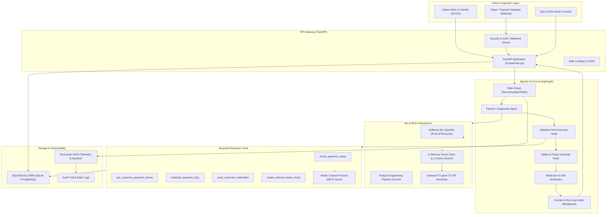

# ReviveAI — Overall System Architecture

This document illustrates the end-to-end architecture of ReviveAI, spanning client interfaces, the FastAPI gateway, the LangGraph multi-agent core, the ML inference engine, tool calling, and persistence layers.

