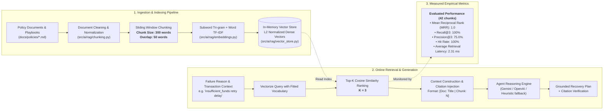

# ReviveAI — RAG Pipeline Architecture

This document diagrams the modular Retrieval-Augmented Generation (RAG) architecture used for payment recovery policy compliance, playbook lookup, and grounded reasoning.

