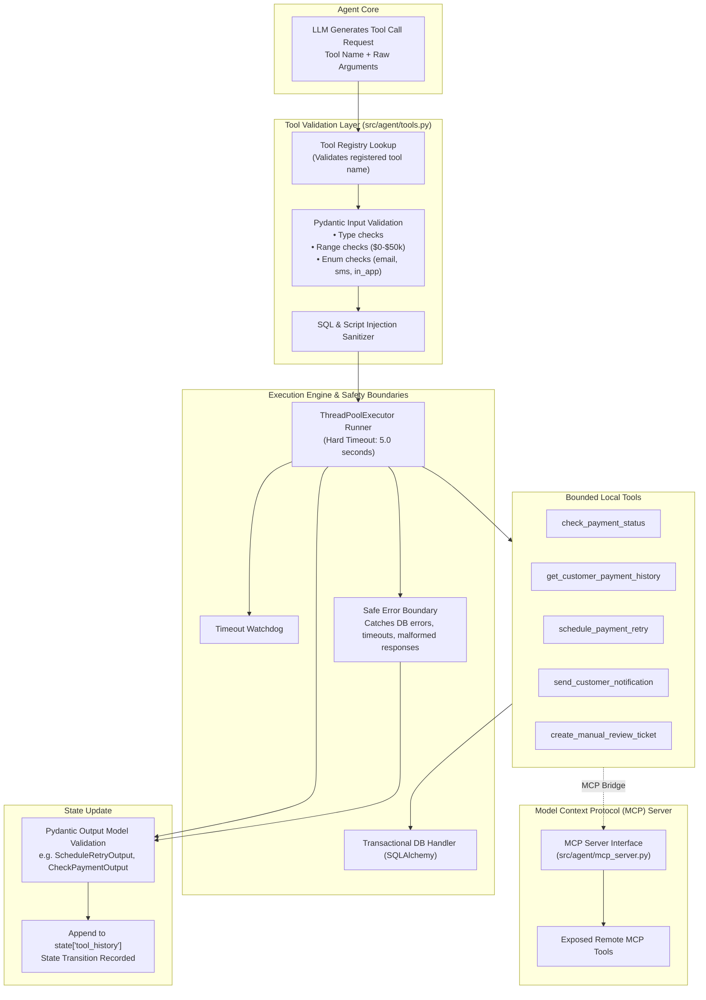

# ReviveAI — Tool Calling & MCP Architecture

This document describes how ReviveAI bridges LLM agent decisions to bounded, typed tools and Model Context Protocol (MCP) clients.

```mermaid
flowchart TD
    subgraph Agent ["Agent Core"]
        Decision["LLM Generates Tool Call Request<br/>Tool Name + Raw Arguments"]
    end

    subgraph Validation ["Tool Validation Layer (src/agent/tools.py)"]
        Registry["Tool Registry Lookup<br/>(Validates registered tool name)"]
        PydanticCheck["Pydantic Input Validation<br/>• Type checks<br/>• Range checks ($0-$50k)<br/>• Enum checks (email, sms, in_app)"]
        Sanitization["SQL & Script Injection Sanitizer"]
    end

    subgraph Execution ["Execution Engine & Safety Boundaries"]
        ThreadPool["ThreadPoolExecutor Runner<br/>(Hard Timeout: 5.0 seconds)"]
        DBHandler["Transactional DB Handler (SQLAlchemy)"]
        TimeoutHandler["Timeout Watchdog"]
        ErrorHandler["Safe Error Boundary<br/>Catches DB errors, timeouts, malformed responses"]
    end

    subgraph ToolsRegistry ["Bounded Local Tools"]
        T1["check_payment_status"]
        T2["get_customer_payment_history"]
        T3["schedule_payment_retry"]
        T4["send_customer_notification"]
        T5["create_manual_review_ticket"]
    end

    subgraph MCPClient ["Model Context Protocol (MCP) Server"]
        MCPEndpoint["MCP Server Interface<br/>(src/agent/mcp_server.py)"]
        MCPTools["Exposed Remote MCP Tools"]
    end

    subgraph StateUpdate ["State Update"]
        OutputModel["Pydantic Output Model Validation<br/>e.g. ScheduleRetryOutput, CheckPaymentOutput"]
        StateLog["Append to state['tool_history']<br/>State Transition Recorded"]
    end

    Decision --> Registry
    Registry --> PydanticCheck
    PydanticCheck --> Sanitization
    Sanitization --> ThreadPool

    ThreadPool --> ToolsRegistry
    ThreadPool --> TimeoutHandler
    ThreadPool --> ErrorHandler

    ToolsRegistry --> DBHandler
    ToolsRegistry -. MCP Bridge .-> MCPEndpoint --> MCPTools

    ThreadPool --> OutputModel
    ErrorHandler --> OutputModel
    OutputModel --> StateLog
```
